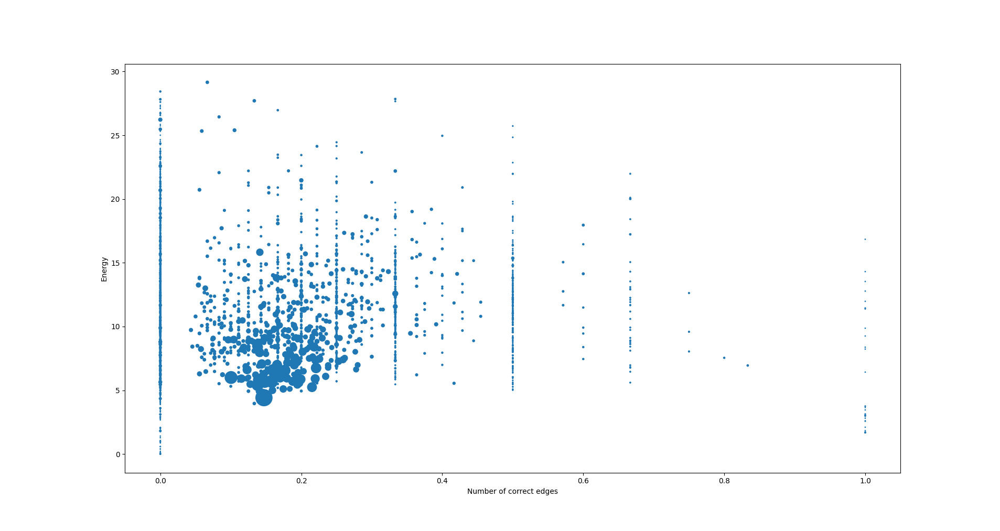

## Introduction

In signed networks, each edge is associated with a sign to indicate the nature of the relationship between the two associated nodes. These signs can have meanings such as trust or distrust, friendship or animosity, influence or opposition. In social media networks, users can oftentimes indicate their relationship to a person or another object as positive or negative. Most online platforms also rely on a recommender system, where a set of people or objects is recommended \cite{recommender}. The choice of recommendations relies on link prediction and link sign prediction, whereas link prediction suggest a new edge for a given node and link sign prediction classifies the link as positive or negative \cite{linkpred, linksignpred}. In this paper we focus  on link sign prediction.

We are given a signed undirected network $G = (V, E, \sigma)$, where $V$ is the set of nodes, $E$ is the set of edges and the function $\sigma: V \times V \rightarrow \{-1, 1\}$, which maps an edge $(i, j) \in E$ to a sign $\sigma(i, j) \in \{-1, 1\}$. 

Given the raw network, we sample a set of test edges $E_{test} \subset E$ and map its sign to a neutral value 0. Therefore the function $\sigma$ is now defined as $\sigma: V \times V \rightarrow \{-1, 0, 1\}$. Analogously we define the sets $E_{train}$ which is defined as $E_{train} = E \setminus E_{test}$. As in previous work, we do not use a validation set. 

( add some remarks about why dont use a validation set and how the test and train datasets are conceptually different from the classical case)

The task is to predict the sign of an edge $(u, v) \in E_{test}$, where $E_{test} \subset E$, where the prediction method can only rely on the structural information of the network and the signs of the edges in $E_{train}$.

### Node Embedding

We compute a node embedding $x_u \in \mathbb{R}^d$ for each node $u \in V$. The embedding is computed using a phyiscal spring simulation, where each edge is modeled as a spring. The springs exert a force on the attached nodes. The nodes are then moved according to the forces acting on them. After a fixed number of iterations, the node positions can be used as node embeddings. To predict the sign of an edge $(u, v) \in E_{test}$, we simply take the distance between the two embeddings $x_u$ and $x_v$ and compare it to a threshold. If the distance is below the threshold, we predict a positive sign, otherwise we predict a negative sign.

The intuition behind this is, that nodes which are connected by a positive edge should be close to each other, while nodes which are connected by a negative edge should be far away from each other.

The plotted node embeddiings for the tribes dataset are shown below:

You can observe that all the tribes are grouped in 3 clusters. The tribes in the same cluster are connected only connected by positive edges, while the tribes in different clusters are connected by negative edges. The tribes dataset is a very simple dataset, and can be solved with only 2 dimensional node embeddings with a 100% accuracy using a 80% train and 20% test split. However for more complex dataset the number of dimensions needs to be increased to encode more complex relationships.

### Spring Network Simulation

We denote $x_i$ as the position of a node $i$. In this context the term position and embedding are used interchangably, as in the end of the algorithm, the position is direclty used as an embedding. Furthermore we use $N_i$ to denote the set of neighbors of node $i$ and $N^{+}_i$ to denote the set of neighbors of node $i$ which are connected by a positive edge. The sets $N^{-}_i$ and $N^{0}_i$ are defined analogously. Furthermore we store a velocity $v_i$ for each node $i$.

For all positive, neutral and negative edges fixed resting lengths $l^{+}$, $l^{0}$ and $l^{-}$ are defined. Furthermore each edge type has a stiffness $\alpha^{+}$, $\alpha^{0}$ and $\alpha^{-}$.

The force acting on a node $(v_i)$ from the edge $(v_i, v_j)$ is the partial derivative of the energy with respect to the node position $\frac{\partial E(x_i, x_j) }{\partial x_i} $. We denote the force coming from negative, neutral and positive nodes as $f^{-}_{i,j}$, $f^{0}_{i,j}$ and $f^{-}_{i,j}$. The partial differential equations evaluate to equations:

$$f^{-}_{i,j} = \alpha^{-} \cdot min(l^{-} - \|{ X_j - X_i}\|_2, 0) \frac{X_j - X_i}{\|{ X_j - X_i}\|_2}$$

$$f^{0}_{i,j} = \alpha^{0} \cdot (l^{0} - \|{ X_j - X_i}\|_2, 0) \frac{X_j - X_i}{\|{ X_j - X_i}\|_2}$$

$$f^{+}_{i,j} = \alpha^{+} \cdot max(l^{+} - \|{ X_j - X_i}\|_2, 0) \frac{X_j - X_i}{\|{ X_j - X_i}\|_2}$$

Therefore the total force acting on a node $v_i$ is:

$$f_i = \sum_{j \in N^{-}_i} f^{-}_{i,j} + \sum_{j \in N^{0}_i} f^{0}_{i,j} + \sum_{j \in N^{+}_i} f^{+}_{i,j}$$

The total force acting on a node $v_i$ is then used to update the position of the node $v_i$ using the kick drift kick method. We use the notation $x_i(t)$ to denote the position of node $v_i$ at time $t$ and $v_i(t)$ to denote the velocity of node $v_i$ at time $t$. To avoid divergence of the simulation, we use a viscous damping factor $d$.

$$v_i(t + \frac{h}{2}) = v_i(t) + \frac{h}{2} \cdot f_i(t) - d \cdot \|{v_i(t)}\|_2$$

$$x_i(t + h) = x_i(t) + h \cdot v_i(t + \frac{h}{2})$$

$$v_i(t + h) = v_i(t + \frac{h}{2}) + \frac{h}{2} \cdot f_i(t + h) - d \cdot \|{v_i(t + \frac{h}{2})}\|_2$$

where $h$ is the size of a timestep.

The simulation is run for a fixed number of iterations. After the simulation has converged, the node positions are used as node embeddings. To predict a sign of an edge $(u, v) \in E_{test}$, we simply take the distance between the two embeddings $x_u$ and $x_v$ and compare it to a threshold. If the distance is below the threshold, we predict a positive sign, otherwise we predict a negative sign.

Now how do we find the optimal parameters for the simulation? Either we use educated guesses, but this is not very efficient. 

### Differentiable Simulation for Parameter Optimization

Using automatic differentiation we are able to compute the derivative of the simulation with respect any input parameter. This allows us to optimize the parameters of the simulation using gradient descent. We use the following loss function to optimize the parameters of the simulation:

For a predefined distance threshold $d_{th}$, the predicted sign of an edge $(u, v)$ is computed using a sigmoid function:

$$\sigma^{\prime}(u, v) = \frac{1}{1 + e^{ \|{x_u - x_v}\|_2 - d_{th}}}$$

We then compute the loss function as follows:

$$l = \frac{1}{|E|} \sum_{(u, v) \in E} (\sigma^{\prime}(u, v) - \sigma(u, v))^2 \cdot \omega(u, v)$$

where $n$ is a normalization function which for a positive edge returns one divided by the number of positive edges, for a neutral edge one divided by the number of neutral edges and for a negative edge one divided by the number of negative edges.

$$\omega(u, v) = \begin{cases} 
\frac{1}{|E^{+}|} & \text{if } \sigma(u, v) = 1 \\ 
\frac{1}{|E^{-}|} & \text{if } \sigma(u, v) = -1 
\end{cases}$$

We used JAX for every computation in the function, this allows use to take the simulation derivative with respect any specified parameter. This yields a gradient which can be used to optimize the parameters of the simulation. Initially the loss was applied to the spring parameters $d_{th}$, $l^{+}$, $l^{0}$, $l^{-}$, $\alpha^{+}$, $\alpha^{0}$ and $\alpha^{-}$ with the following results:

| Parameter | Value | Description |
| --- | --- | --- |
| $d_{th}$ | 14.420479774475098 | Distance threshold for the sigmoid function. |
| $l^{+}$ | 9.82265567779541 | Resting length of a positive edge. |
| $l^{0}$ | 16.775850296020508 | Resting length of a neutral edge. |
| $l^{-}$ | 20.94917106628418 | Resting length of a negative edge. |
| $\alpha^{+}$ | 7.730042457580566 | Stiffness of a positive edge. |
| $\alpha^{0}$ | 1.1881768703460693 | Stiffness of a neutral edge. |
| $\alpha^{-}$ | 14.80991268157959 | Stiffness of a negative edge. |

We can see how the gradient descent improves the parameters, with a 16 dimensional embedding on the Bitcoin Alpha dataset:

The main reason why the loss and the measures are so 'jagged' is that the initial condiations of the node positions are randomized for each epoch. 

## Training

The training process for the datasets can be challenging. As the loss needs to differentiated over a large number of simulation iterations, this requires large amounts of GPU memory. Therefore training on the entire graph is not possible. To overcome this problem we use a graph subsampling method. We sample a fixed number of nodes from the graph and only compute the loss for the sampled nodes. This allows us to train on large graphs. However the subsampling method introduces a bias, as the loss is only computed for a subset of the graph. To overcome this problem we use a batched subsampling method. We sample a fixed number of nodes for each batch and compute the loss for each batch. This allows us to train on the entire graph, while still being able to train on large graphs. The batched subsampling method is described in the paper [Inductive Representation Learning on Large Graphs](https://arxiv.org/pdf/1706.02216.pdf) by William L. Hamilton, Rex Ying and Jure Leskovec.

## Results

Impact of dimensionality on the performance of the method:

Impact of simulation iterations on the performance of the method:

Impact of damping factor on the performance of the method:

### Local graph structures

### Comparison to other previous best method

### Energy minima and score correlations

Generally a decrease in energy in the system correlates with a better performance of the method. However the effect is much more pronounced in the beginning of the method.

### Correlation between energy 

## Sources:

For aggregation methods and graph subsampling:
@book{hamilton_ying_leskovec, title={Inductive Representation Learning on Large Graphs}, url={https://arxiv.org/pdf/1706.02216.pdf}, author={Hamilton, William and Ying, Rex and Leskovec, Jure} }

Signed Network Node Embedding via Dual
Attention Mechanism
‌@misc{ieee xplore full-text pdf:_2023, url={https://ieeexplore.ieee.org/stamp/stamp.jsp?tp=&arnumber=9915410}, journal={Ieee.org}, year={2023} }

Differentiable AUC scores
@article{eban_schain_mackey_gordon_saurous_elidan, title={Scalable Learning of Non-Decomposable Objectives}, volume={54}, url={https://arxiv.org/pdf/1608.04802.pdf}, author={Eban, Elad and Schain, Mariano and Mackey, Alan and Gordon, Ariel and Saurous, Rif and Elidan, Gal} }

‌
## Things I tried but did not work

### Message Passing Neural Network for local pattern recognition

As of now we have hardcoded the forces acting on a node as:

$$f_i = \sum_{j \in N^{-}_i} f^{-}_{i,j} + \sum_{j \in N^{0}_i} f^{0}_{i,j} + \sum_{j \in N^{+}_i} f^{+}_{i,j}$$

The above assumption is based on the social balance theory and does apply to many dynamics in networks. (Add some sort of evidence?)
However there might be more complex patterns in the network, which we are not able to capture with the above method. Therefore we are looking for a function $B$, which given an edge $(u, v)$ and two auxillary information vectors $m_u$ and $m_v$ for the nodes $u$ and $v$ respectively, computes values $s^{-}$, $s^{0}$ and $s^{+}$ which denote the strength of the positive and negative relationship between the two nodes. We then compute the forces acting on the nodes as follows:

$$f_i = \sum_{j \in N} f^{-}_{i,j} \cdot s^{-} + f^{+}_{i,j} \cdot s^{+} + f^{0}_{i,j} \cdot s^{0}$$

The auxillary vectors $m_i \in \mathbb{R}^d$ are computed using a message passing neural network $A$. 

#### Message Passing Neural Network $A$

A message passing neural network is a neural network which is applied for each node on all of its input edges. This neural network is usually applied for several recursive iterations, which leads to information propagating thrue the graph. The auxillary information vectors $m_i$ are initialized as random vectors. 

A single step of a message passing neural network on a node $i$ is defined as follows:

$$m_i(t+1) = \Phi \left[ m_i(t), \mathop{\bigoplus}\limits_{j \in N_i} \Psi \left( m_i(t), m_j(t), \sigma(i, j) \right) \right]$$

where $\Phi$ and $\Psi$ are neural networks and $\oplus$ is a permutation invariant aggregation function. Examples for aggregation functions are sum, mean, max, min, etc.

#### Force decision network $B$

Network $B$ maps between two nodes $u$ and $v$ and their auxillary information vectors $m_u$ and $m_v$ to a vector $s \in \mathbb{R}^3$, which denotes the strength of the positive and negative relationship between the two nodes. The network is defined as follows:

$$s = B(m_u, m_v, \sigma(u, v))$$

#### Training Step

A trainig step of the entire process then looks as follows:

1. Sample $x_i$ and $m_i$ for all nodes $i \in V$ from a normal distribution. Initialize $v_i$ to zero.
2. Run the message passing neural network $A$ for a fixed number of iterations.
3. Run the force decision network $B$ for all edges $(u, v) \in E$. 
4. Run the spring network simulation for a fixed number of iterations.
5. Predict the sign of an edge $(u, v)$ using the distance between $x_u$ and $x_v$.
6. Compute the loss and update the parameters of the message passing neural network $A$ and the force decision network $B$ using gradient descent.
7. Repeat from step 1.

Even though I was able to train the network to a low loss, the performance of the network was not better than the original method. Furthermore there is a reasoning mistake in the above method. Above all the message passing network $A$ and $B$ together are most of all trained to predict the sign of each edge. Naturally they are able to also predict a probability for each possibility (-1, 0, 1) which gives it a somewhat improved capaility from the original method. However the overhead and the imprecision which comes from the uncertain training signal is not worth the small improvement in performance. Furthermore if $A$ and $B$ are trained to predict the sign of an edge successfully, there is no real reason to apply the spring network simulation, as the network $A$ and $B$ already capture the local graph structure.

### Learning the force functions using a neural network

As denoted above the force acting on a node $v_i$ from the edge $(v_i, v_j)$ is the partial derivative of the energy with respect to the node position $\frac{\partial E(x_i, x_j) }{\partial x_i} $. We denote the force coming from negative, neutral and positive nodes as $f^{-}_{i,j}$, $f^{0}_{i,j}$ and $f^{-}_{i,j}$. The partial differential equations evaluate to equations:

$$f^{-}_{i,j} = \alpha^{-} \cdot min(l^{-} - \|{ X_j - X_i}\|_2, 0) \frac{X_j - X_i}{\|{ X_j - X_i}\|_2}$$

$$f^{0}_{i,j} = \alpha^{0} \cdot (l^{0} - \|{ X_j - X_i}\|_2, 0) \frac{X_j - X_i}{\|{ X_j - X_i}\|_2}$$

$$f^{+}_{i,j} = \alpha^{+} \cdot max(l^{+} - \|{ X_j - X_i}\|_2, 0) \frac{X_j - X_i}{\|{ X_j - X_i}\|_2}$$

The idea is to learn a function $F$, which given the distance between two nodes $d = \|{ X_j - X_i}\|_2$ and the edge type $\sigma(i, j)$, computes the force $f_{i, j}$. To do so I pretrained the network on the heuristic force functions and then finetuned the network on the Bitcoin Alpha dataset. The results are shown below:

The training process in the framework is extremely fragile and the network is able to improve its force function, however the initial heuristic method did by far outperform this strategy.

### Learning the force functions using a piecewise linear function

Since th

### The fundamental problems in the training process

- If we want to successfully optimize the loss function for the state achieved after say 300 iterations, its also necessary to train it for 300 iterations. Its possible to increase the delta time and decrease the number of iterations, however this only works up to a certain factor of around 3. If we increase the delta time too much, the simulation diverges due to numerical instability. If we decrease the number of iterations too much, the simulation does not converge to a stable state.

- Therefore each training step is very expensive and the loss surface we are trying to optimize is very uneven. Even very small changes in the parameters can lead to a very large change in the loss.

- Training on smaller graphs does not translate well to larger graphs, as in larger graphs the nodes have more larger degrees. The more edges are connected to a single node, the more forces are acting on the node. Therefore the same force function do not translate from small to big networks. Furthermore as the graph structure becomes large, there might be additional forces pulling the entire network to the center of the graph. I was however not able to verify this claim.