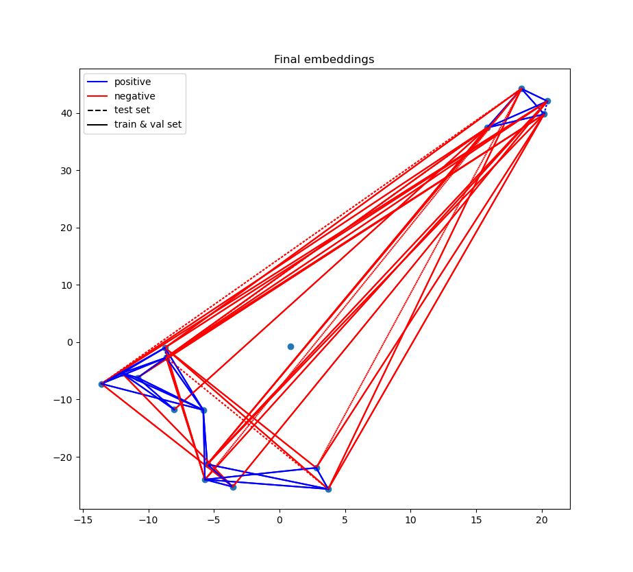
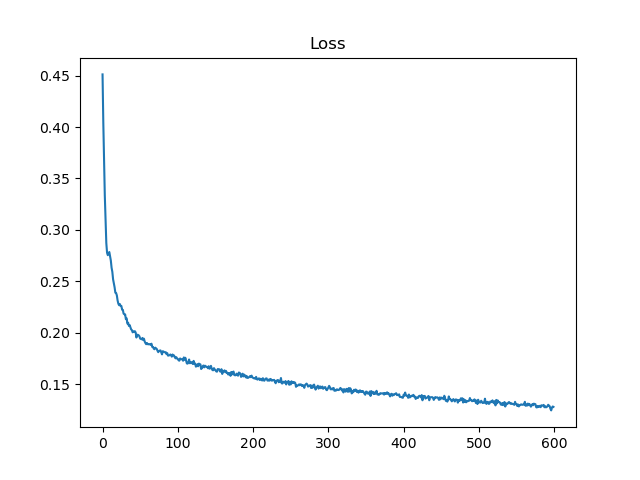
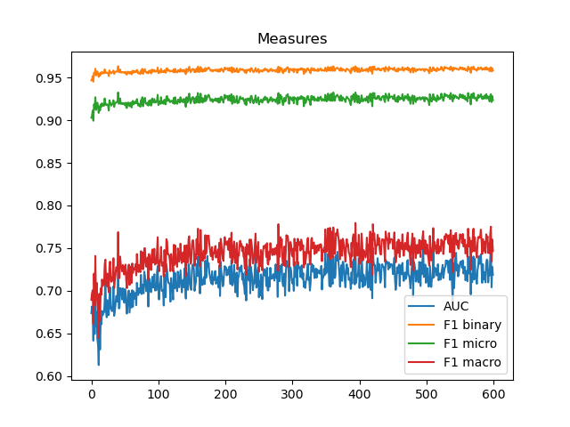
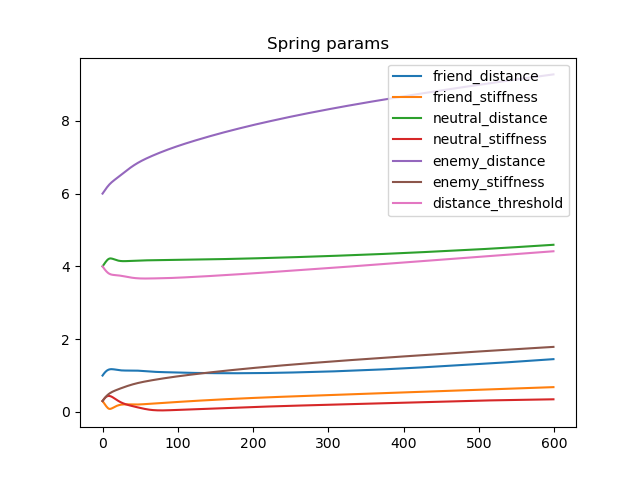
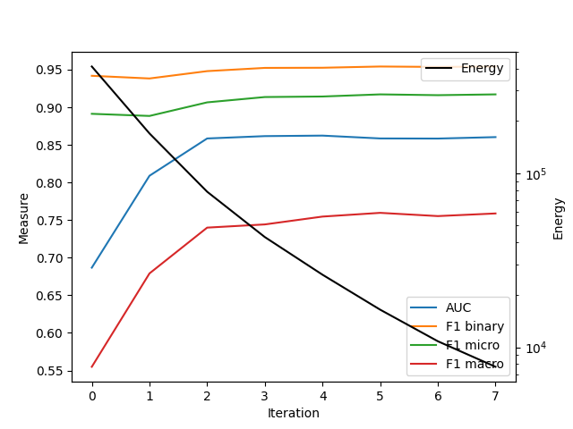

# *SpringE*: Fast Node Representation Generation for Link Sign Prediction

A signed network is a graph where each edge represent either a positive or negative relationship between its two nodes. This paper proposes \textit{SpringE}, which is able to capture crucial information about the local node environment using low dimensional feature vectors. Contrary to other methods, no neural network is used, which greatly increases the runtime of the given method. 

## Requirements

You can try to install to setup the environment using the ```environment.yaml``` file. To do so run ```conda env create -f environment.yaml```. ( You need to have conda or conda-mini installed.)

If that does not work, you can install the following packages manually:

- tqdm
- numpy
- scipy
- pyg-nightly (Many unreleased features are used, so you need to install the nightly version)
- skikit-learn
- torch
- pyyaml
- pandas
- matplotlib
- nevergrad
- networkx (Install direclty from source as unreleased features are used.)

In order to use the GPU, you need to install CUDA and PyTorch with CUDA support.

## Running the code

Run ```python src/main.py``` where the following arguments can opionally be passed to the script. 

- ```-i <value>``` sets the number of iterations for the spring network simulation. Default is 1000.
- ```-d <value>``` sets the damping factor for the spring network simulation. Default is  0.02.
- ```-h <value>``` sets the size of a timestep for the spring network simulation. Default is 0.005.
- ```-s <value>``` sets the dimensionality of the node embeddings. Default is 64.
- ```-o <value>``` if set starts the nevergrad optimization with the given number of iterations. The recommendations can then be stored as the new default parameters in the ```params.yaml``` file. Recommended is around 30 iterations.

The script asks the user to select a dataset in the terminal after execution.

## Testing the code

run ```pytest``` in the ```src``` folder.


## Method

### Task Definition

We are given a signed network $G = (V, E, \sigma)$, where $V$ is the set of nodes, $E$ is the set of edges and $\sigma: E \rightarrow \{-1, 1\}$ is the sign function. The task is to predict the sign of a given edge $(u, v) \in E$.

To do so we randomly sample a set of edges $E_{test} \subset E$ and set the sign to a neutral value 0. We want to find a function $f: V \times V \rightarrow \mathbb{R}$, which maps an edge $(u, v) \in E_{test}$ to a sign $\sigma(u, v) \in \{-1, 1\}$.

### Node Embedding

We compute a node embedding $x_u \in \mathbb{R}^d$ for each node $u \in V$. The embedding is computed using a phyiscal spring simulation, where each edge is modeled as a spring. The springs exert a force on the attached nodes. The nodes are then moved according to the forces acting on them. After a fixed number of iterations, the node positions can be used as node embeddings. To predict the sign of an edge $(u, v) \in E_{test}$, we simply take the distance between the two embeddings $x_u$ and $x_v$ and compare it to a threshold. If the distance is below the threshold, we predict a positive sign, otherwise we predict a negative sign.

The intuition behind this is, that nodes which are connected by a positive edge should be close to each other, while nodes which are connected by a negative edge should be far away from each other.

The plotted node embeddiings for the tribes dataset are shown below:



You can observe that all the tribes are grouped in 3 clusters. The tribes in the same cluster are connected only connected by positive edges, while the tribes in different clusters are connected by negative edges. The tribes dataset is a very simple dataset, and can be solved with only 2 dimensional node embeddings with a 100% accuracy using a 80% train and 20% test split. However for more complex dataset the number of dimensions needs to be increased to encode more complex relationships.

### Spring Network Simulation

For all positive, neutral and negative edges fixed resting lengths $l^{+}$, $l^{0}$ and $l^{-}$ are defined. The actual length of an edge is denoted as $L_{l,k} = \|{X_l - X_k}\|_2$. Furthermore each edge type has a stiffness $\alpha^{+}$, $\alpha^{0}$ and $\alpha^{-}$.

The force acting on a node $(v_i)$ from the edge $(v_i, v_j)$ is the partial derivative of the energy with respect to the node position $\frac{\partial E(X_1, X_2) }{\partial X_1} $. We denote the force coming from negative, neutral and positive nodes as $f^{-}_{i,j}$, $f^{0}_{i,j}$ and $f^{-}_{i,j}$. The partial differential equations evaluate to equations:

$$f^{-}_{i,j} = \alpha^{-} \times min(l^{-} - L_i, 0) \frac{X_j - X_i}{\|{ X_j - X_i}\|_2}$$

$$f^{0}_{i,j} = \alpha^{0} \times (l^{0} - L_i, 0) \frac{X_j - X_i}{\|{ X_j - X_i}\|_2}$$

$$f^{+}_{i,j} = \alpha^{+} \times max(l^{+} - L_i, 0) \frac{X_j - X_i}{\|{ X_j - X_i}\|_2}$$

where $L_i$ is the number of negative edges connected to node $v_i$ and $l^{-}$, $l^{0}$ and $l^{+}$ are the thresholds for the negative, neutral and positive force respectively. $\alpha^{-}$, $\alpha^{0}$ and $\alpha^{+}$ are the scaling factors for the negative, neutral and positive force respectively.

### Differentiable Simulation for Parameter Optimization

I have rewritten the entire code and made it JAX comptabile. 

Now the simulation is differentiable and for each simulation run we evaulate a loss function which correlates to the common measures (auc, f1scores). However the loss function must be differentiated, therefore I slightly changed the scoring function (which can be used as an inverse loss function). 

For a predefined distance threshold $d_{th}$, the predicted sign of an edge $(u, v)$ is computed using a sigmoid function:

$$\sigma^{\prime}(u, v) = \frac{1}{1 + e^{ \cdot \||x_u - x_v||_2 - d_{th}}}$$

We then compute the loss function as follows:

$$l = \frac{1}{|E|} \sum_{(u, v) \in E} (\sigma^{\prime}(u, v) - \sigma(u, v))^2 \cdot n(u, v)$$

where $n$ is a normalization function which for a positive edge returns one divided by the number of positive edges, for a neutral edge one divided by the number of neutral edges and for a negative edge one divided by the number of negative edges.

$$n(u, v) = \begin{cases} 
\frac{1}{|E^{+}|} & \text{if } \sigma(u, v) = 1 \\ 
\frac{1}{|E^{-}|} & \text{if } \sigma(u, v) = -1 
\end{cases}$$


We used JAX for every computation in the function, this allows use to take the simulation derivative with respect any specified parameter. This yields a gradient which can be used to optimize the parameters of the simulation. Initially the loss was applied to the spring parameters $d_{th}$, $l^{+}$, $l^{0}$, $l^{-}$, $\alpha^{+}$, $\alpha^{0}$ and $\alpha^{-}$ with the following results:

| Parameter | Value |
| --- | --- |
| $d_{th}$ | 14.420479774475098 |
| $l^{+}$ | 9.82265567779541 |
| $l^{0}$ | 16.775850296020508 |
| $l^{-}$ | 20.94917106628418 |
| $\alpha^{+}$ | 7.730042457580566 |
| $\alpha^{0}$ | 1.1881768703460693 |
| $\alpha^{-}$ | 14.80991268157959 |

We can see how the network learns, with a 16 dimensional embedding on the Bitcoin Alpha dataset:



The main reason why the loss and the measures are so 'jagged' is that the initial condiations of the node positions are randomized for each epoch. 






### Neural Network for local pattern recognition

As of now it is clear that if an edge has a positive sign, this results in a force which pulls the two nodes together. If an edge has a negative sign, this results in a force which pushes the two nodes apart. We are simply applying the social balance theory. Howoever this is a simple model, and theory it could be possible, that more complex patterns exist. In the next step we are trying to find such patterns using a neural network and the above described simulation derivative.

We want to learn a function, which for a given edge, decides weather the two nodes should be pulled together, pushed apart or stay at a neutral distance.

We train two neural networks, a message passing network $M$ which generated an auxillary information vector for each node and a network $T$ which takes the auxillary information vector, the edge signs and positions of the nodes to decide on the forces acting on the nodes.

The message passing network can be seen as a function which for each node $v_i$ computes an auxillary information vector $m_i \in \mathbb{R}^d$. The auxillary information vector is computed by passing a message from each neighbor $v_j$ to the node $v_i$. The message is computed as follows:

$$m_{i}^{(t+1)} = \sum_{j} M(m_{j}^{(t)})$$

where $N(i)$ is the set of neighbors of node $v_i$ and $\sigma_{i,j}$ is the sign of the edge $(v_i, v_j)$. The function $M$ is a fully connected neural network with $k$ hidden layers and $d$ hidden units per layer. The function $M$ is shared across all nodes.

Each layer can be described as a function $M_i$ which works as follows:

$$M_i(m_{j}^{(t)}) = activation(W_{i} \cdot m_{j}^{(t)} + b_{i})$$

where $W_{i} \in \mathbb{R}^{d \times d}$ and $b_{i} \in \mathbb{R}^{d}$ are the weights and biases of the $i$-th layer respectively and $activation$ is a non-linear activation function.

The full message passing network $M$ can be described as follows:

$$M(m_{j}^{(t)}) = M_k(M_{k-1}(...M_1(m_{j}^{(t)})...))$$

After a fixed number of message passing iterations are completed and the auxillary vector for each node is given, network $T$ computes the forces acting on each node. The network $T$ takes the auxillary information vector $m_i$ of each node $v_i$, the sign of the edge $(v_i, v_j)$ and the positions of the nodes $X_i$ and $X_j$ as input and computes the forces $f_{i,j}$ and $f_{j,i}$ acting on the nodes $v_i$ and $v_j$ respectively. The network $T$ can be described as follows:

$$T(m_i, m_j, \sigma_{i,j}, X_i, X_j) = (f_{i,j}, f_{j,i})$$

A single prediction then looks as follows:

1. Compute the auxillary information vector for each node using a fixed number of iterations of the message passing network $M$.
2. Compute the forces using the graph transformer network $T$.
3. Advance the simulation using the computed forces.
4. Repeat 2. and 3. until the simulation has converged.

The network can be trained as follows:

We predict the node embeddings using the above method, we then compute a loss and propagate thrue the entire network to update the weights of the message passing network $M$ and the graph transformer network $T$.

## Training

The training process of the neural networks is challenging as a single simulation run takes up to a minute on my machine on all of the datasets. Therefore we use the Tribes dataset as a pretraining and then finetune the network on the other datasets. This saves a lot of time as the Tribes dataset is very small and can be simulated very quickly.

## Results

### Comparison to other previous best method


### Energy minima and score correlations

Generally a decrease in energy in the system correlates with a better performance of the method. However the effect is much more pronounced in the beginning of the method.




### Correlation between energy 


## Sources:

For aggregation methods and graph subsampling:
@book{hamilton_ying_leskovec, title={Inductive Representation Learning on Large Graphs}, url={https://arxiv.org/pdf/1706.02216.pdf}, author={Hamilton, William and Ying, Rex and Leskovec, Jure} }

‌