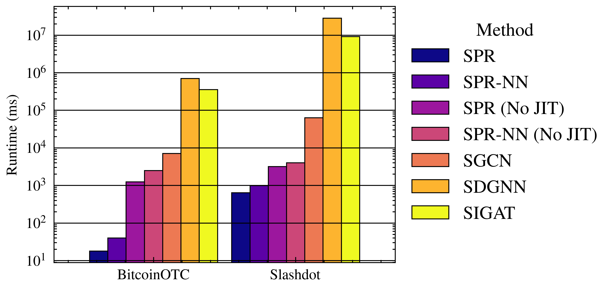

# Force Directed Node Embedding for Link Sign Prediction

This is the code for the paper called (Papername) which was published in (Journalname). The paper can be found here: (Link to paper)

## Running the code

### Dependencies

Installation instructions for Ubuntu (conda venv recommended):

1. Install jax: 
``pip install -U "jax[cuda12]"``
2. Install pytorch (CPU version !) ``pip install torch torchvision torchaudio --index-url https://download.pytorch.org/whl/cpu``
3. Install other dependencies: ``pip install torch_geometric matplotlib scikit-learn pyyaml tqdm optax inquirer pandas``

### Training

To start the training run ```python src/train.py <Dataset Name> params/train_params.yaml``` where BitcoinAlpha can be either:

- BitcoinAlpha
- BitcoinOTC
- Epinions
- Slashdot 
- WikiRFA
- Tribes

The datasets are downloaded over network, hence an active internet connection is necessary. The parameter file can be adjusted as desired and looks as follows:

```
num_dimensions: 64 # k from the paper
use_neural_force: False # True is SPR-NN, False is SPR
use_blackbox : False
num_simulations: 300
train_iterations: 120 # n from the paper
train_dt: 0.01 #dt from the paper
train_damping: 0.05 # damping from the papaer
learning_rate: 0.09
init_pos_range: 1.0 # range from the initial uniform random distibution
enable_partitioning: False # not used in paper
number_of_subgraphs: 4 # not used in paper
gradient_multisteps: 1 # not used in paper
threshold: 2.5 # mu from the paper
seed: 0 # seed the seed for reproducability. Numerical Instabilities cannot be completely avoided.
```

A training run outputs a model file, which can be found under ```model/<ModelName>.yaml``` and a csv with the stats of the training under ```plots/data/training_process.csv```. The stats can be ploted by running ```python plots/forward.py``` which produces the following image:


### Testing

To test the model against different datasets execute ```ipython src/get_benchmarks.py <Dataset Name> params/test_params.yaml```. The parameter file can be adjusted as desired and looks as follows. For describtions of the parameters refer to the Training section.

```
num_dimensions: 64
use_neural_force: True
use_blackbox : False
test_iterations: 120
test_dt: 0.001
test_damping: 0.95
init_pos_range: 1.0
threshold: 2.5
num_shots : 5
seed : 0
```

Note that we use IPython here (install with ```pip install ipython```) for accurate time measurements. The script will generate a .csv file in the format ```<Dataset Name>_<num dimensions>_<nn / spring>.csv```. The training times are displayed in the command line and of now, manually collected in the ```plots/data/speedup.csv``` file. You can generate a plot of speedups with  ```python plots/speedup.py``` such as:



## Important Code / Paper sections

The graph spring network layer as described in the paper is

$$
    \text{gsn}(\mathbf{x}_i) = g(\mathbf{y}_i) \cdot \sum_{j \in N_i} f \bigl(\mathbf{z}_{i,j}, d(\mathbf{x}_{i}, \mathbf{x}_{j})\bigr) \cdot \frac{\mathbf{x}_j - \mathbf{x}_i}{d(\mathbf{x}_i, \mathbf{x}_j)}.
$$

The spring network layer for the specific implementations SPR and SPR-NN can be found in ``src/euler.py``. In the same file, ``euler_step()`` implements the update method $\Phi$ as described in the paper as

$$
    \Phi \bigl( \mathbf{S}(t) \bigr) = \begin{bmatrix}
        1 & 0 \\ 0 & (1-d) 
    \end{bmatrix}\mathbf{S}(t) + dt \begin{bmatrix} \mathbf{V}(t) \\  \mathbf{F}(t)\end{bmatrix}.
$$

The whole forward simulation as described in the paper as 

$$
    \mathbf{S}(n ) = (\overbrace{\Phi \circ \dots \circ \Phi}^{n \text{-times}})(\mathbf{S}(0) )
$$

is implemented in ``src/simulation`` in the function ``simulate()``.

The loss function 
$$
    L(G, \textbf{S}(t)) = \sum_{(u, v) \in E} (\sigma(u, v) - {\sigma}(u, v))^2 \cdot \omega(u, v)
$$ 
can be found in ``src/simulation`` as ``loss()``, which is then combined with a forward simulation in ``simulate_and_loss()``. 

The gradient 
$$
    \nabla L  = \frac{\partial L}{\partial \mathbf{S}(n)} \frac{\partial \mathbf{S}(n)}{\partial \mathbf{p}} + \frac{\partial L}{\partial \mathbf{p}}
$$

is evaluated in ``src/trainer.py`` using the line 

```
value_and_grad_fn = jax.value_and_grad(sm.simulate_and_loss, argnums=3, has_aux=True)
```

### Graph preprocessing

All releveant code to graph preprocessing can be found in ``src/graph/graph.py`` and ``src/graph/split.py``.