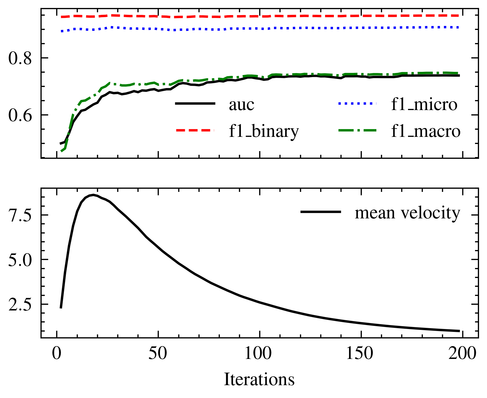

# Force Directed Node Embedding for Link Sign Prediction

This is the code for the paper called (Papername) which was published in (Journalname). The paper can be found here: (Link to paper)

## Running the code

### Dependencies

Installation instructions for Ubuntu (conda venv recommended):

1. Install jax: 
``pip install -U "jax[cuda12]"``
2. Install pytorch (CPU version !) ``pip install torch torchvision torchaudio --index-url https://download.pytorch.org/whl/cpu``
3. Install other dependencies: ``pip install torch_geometric matplotlib scikit-learn pyyaml tqdm optax inquirer pandas``

### Training

To start the training run ```python src/train.py <Dataset Name> params/train_params.yaml``` where BitcoinAlpha can be either:

- BitcoinAlpha
- BitcoinOTC
- Epinions
- Slashdot 
- WikiRFA
- Tribes

the parameter file can be adjusted as desired.

A training run outputs a model file, which can be found under ```model/<ModelName>.yaml``` and a csv with the stats of the training under ```plots/data/training_process.csv```. The stats can be ploted by running ```python plots/forward.py``` which produces the following image:



### Testing

To test the model against different datasets execute ```python src/train.py <Dataset Name> params/test_params.yaml```.
